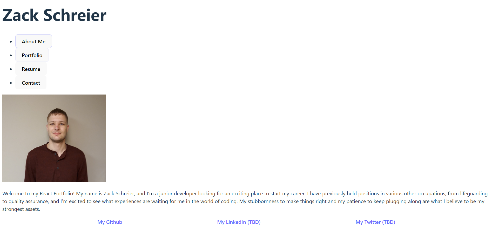

# **Module 20:** React Portfolio

## Key Information

*This repository will be continually updated in the weeks/months to come; some aspects of the portfolio may appear outdated, but rest assured that they will be updated in the future.*

## Description

The goal of this project was to create a portfolio using react with a navbar that would make different components visible when clicked on, namely an About Me section, a Resume section, a Contact area, and a Portfolio section including some past projects. Implementation was difficult at times, especially in the realm of deployment, as some deployment apps faced technical issues outside of the developer's control.

# Preview

The deployed portfolio can be found here: [Portfolio - Zack Schreier](https://google.com)

The following screenshot provides a quick look at the initial rendering of the page: 